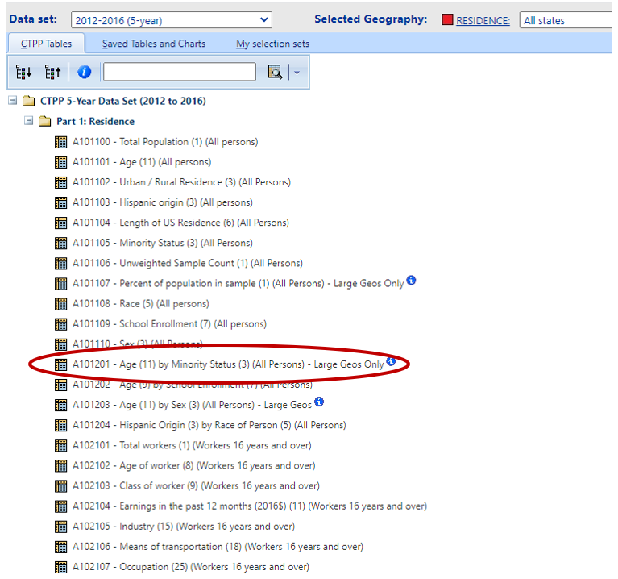

# CTPP Case Studies

This chapter provides a series of case studies for using the CTPP data for various analytical purposes. The code presented here are for illustrative purposes and it is the hope that analysts using this field guide will be able to take the code and manipulate it for their own needs.

## Case Study 1 - Understand Nationwide Demographic Trends

**Scenario**: Emily Planner is a GS5 who has recently joined FHWA's Office of Planning, Environment, and Realty (HEP). On the first week of her job, her supervisor comes to her and tells her that HEP is working to gather data to address historical inequities. Her supervisor asks her asks her that as part of the administration's initiative to address historical inequities, can she gather information about demographic trends in the nation. Also, while she is pulling up this data, can she also create a handy visual that provides decision makers with a snapshot of these trends at a macro level.

After her supervisor hands over this assignment, Emily, having attended training offered by AASHTO, recalls that the CTPP has this information available in a handy manner and she can download the data quickly and develop the desired visual.

### Analysis Steps for Case Study 1

The first thing that Emily does is head over to the [CTPP website](https://ctpp.transportation.org/) and gets to the CTPP data (Figure \@ref(fig:cs1) and Figure \@ref(fig:cs2)). 

```{r cs1, echo=FALSE, fig.cap="CTPP Website"}
# No fig.retina (using default fig.retina = 2)
knitr::include_graphics("images/r1.PNG") 
```
```{r cs2, echo=FALSE, fig.cap="CTPP Data Access"}
# No fig.retina (using default fig.retina = 2)
knitr::include_graphics("images/r2.PNG") 
```
Knowing that she might be asked to retrieve this and other information on regular basis, Emily decides to create an account on the CTPP page to store her data calls and have it available on a regular basis (Figure \@ref(fig:cs3)) 

```{r cs3, echo=FALSE, fig.cap="CTPP Login Details"}
# No fig.retina (using default fig.retina = 2)
 
```
She then selects the 2012--2016 Part 1 --- Residence tables and from this list selects table **A101201 --- Age (11) by Minority Status (3) (All Persons)**. She notes that this information is available *only at large geographies* _(the data is available only at the State, County, MCD, Place, PUMA/POWPUMA, MSA levels)_. This level of geography was sufficient for the purposes of her analysis and she decides that this is the table she will use for her analysis (Figure \@ref(fig:cs4)) and proceeds to download it as a CSV file (Figure \@ref(fig:cs5))

```{r cs4, echo=FALSE, fig.cap="Select Relevant CTPP Table"}
# No fig.retina (using default fig.retina = 2)
 
```    

```{r cs5, echo=FALSE, fig.cap="Download Relevant CTPP Table",out.width='100%'}
# No fig.retina (using default fig.retina = 2)
 
```    

The resulting dataset is show in Figure \@ref(fig:cs6)

```{r cs6, echo=FALSE, fig.cap="Table A101201"}
# No fig.retina (using default fig.retina = 2)
knitr::include_graphics("images/r6.PNG") 
```    
Having downloaded the dataset, Emily proceeds to create the visual requested by her supervisor. She decides that a population pyramid for all states would be a handy visual for decision makers to have at their finger tips. To create this visual Emily undertakes the following steps. 

The data downloaded from the CTPP website does not have Census georeferences handy therefore Emily decides to map the *GEOID* to the data table downloaded from the CTPP site.

```{r , echo=TRUE, message=FALSE, warning=FALSE}
#Load Libraries
library(data.table)
library(tidyverse)
library(geofacet)

## Use data.table library to read the input file and merge it with GEOID file 


## First read the data from the CSV downloaded in the previous step
A101201 <- fread("data/A101201.csv",header=TRUE,sep=",")

## Next read in the state file and set it as a data.table object (setDT command)

stategeo <- setDT(readRDS("data/state_geoids.RDS")) 

## Merge the two files

# Sort by NAME
setkey(A101201,NAME)
setkey(stategeo,NAME)

# Now merge the files
A101201A <- stategeo[A101201]

# View the resulting data frame
tibble(A101201A)
```
Emily then cleans up the resulting dataset and creates the Population Structure by Age and Minority Status by state (Figure \@ref(fig:pop))


```{r pop, echo=TRUE, message=FALSE, warning=FALSE, fig.cap="Population Structure by Age and Minority Status",out.width='100%'}
# Cleanup the dataset  
A101201B <- A101201A %>% filter(str_detect(Age, "^Age"), # Selects rows that starts with Age in the Age Column
                                Output != "Margin of Error", Minority !="Total persons") %>% #Deletes rows where Output=Margin of Error and Minority = Total Persons 
  group_by(NAME) %>% #groups by state
  mutate(prop = Population / sum(Population, na.rm = TRUE)) %>% # Calculate percentage by Race
  ungroup() %>%
  mutate(prop = ifelse(Minority == "White alone, not Hispanic/Latino", -prop, prop)) # Setup data for mapping

ggplot(A101201B, aes(x = prop, y = Age, fill = Minority)) + 
  geom_col(width = 1) + 
  theme_minimal() + 
  scale_fill_manual(values = c("darkred", "navy")) + 
  facet_geo(~NAME, grid = "us_state_with_DC_PR_grid2",
            label = "code") + 
  theme(axis.text = element_blank(),
        strip.text.x = element_text(size = 8)) + 
  labs(x = "", 
       y = "", 
       title = "Population structure by Age and Minority Status", 
       fill = "", 
       caption = "Data source: 2012-2016 CTPP Table A101201")
```

## Case Study 2 - Statewide Snapshot of Mean Travel Times

**Scenario**: Jenny Modeler is a member of the Forecasting and Trends Office at the Florida DOT and they have been requested by their supervisor to provide a county level estimate of average travel times for commuters. 

### Analysis Steps for Case Study 2

Jenny heads to the CTPP site, and they create a new selection set showing only Florida counties and download table **B106202 --- Mean Travel time (1) by Means of transportation (18) (Workers 16 years and over who did not work at home)**. The resulting dataset is show in Figure \@ref(fig:cs7)

```{r cs7, echo=FALSE, fig.cap="Table B106202",out.width='100%'}
# No fig.retina (using default fig.retina = 2)
knitr::include_graphics("images/r7.PNG") 
```    


The first step is to restructure the data and attach the county geometry to the data. The steps that Jenny undertakes is given in the code chunk below.


```{r , echo=TRUE, message=FALSE, warning=FALSE}
#Load Libraries
# Note that some of the libraries have been loaded previously and are available in the current session
library(ggiraph)
library(patchwork)

# Read in B106202 (Mean Travel Time by Means of Transportation)
mot <- read_csv("data/B106202.csv")

# Filter the dataset to include only Total Means of Transportation
mottal <- mot %>% filter(MOT=='Total, means of transportation')

# The Mean Travel Time is read in a string variable and it is converted to a numeric variable
mottal$mtt <- as.numeric(as.character(mottal$MeanTT))

# Delete the string variable
mottal <- subset(mottal,select=-c(MeanTT))

# View the resulting dataset
tibble(mottal)

# This step converts the data from long format to wide format and gets one record per county
mottal_l <- spread(mottal,Output,mtt)

# View the resulting dataset
tibble(mottal_l)

# Read in the Geography Files
fl <- readRDS("data/FL_geos.RDS")

# Merge the geometry data with the mean travel time estimates
motfl <- merge(fl,mottal_l)

# View the resulting dataset
tibble(motfl)
```

Now that Jenny has cleaned up the dataset, it is ready for visualization as requested by their supervisor. The next steps undertaken by Jenny provides a visual representation of the mean travel times by County and their supervisor can click on the county and identify the total average travel time (Figure \@ref(fig:ttime))

```{r ttime, echo=TRUE, message=FALSE, warning=FALSE, fig.cap="Mean Travel Time by County in Florida",out.width='100%'}
# Clean up County Names
motfl <- motfl %>% mutate(NAME = str_remove(NAME, " County, Florida"))

# Create interactive map
fl_map <- ggplot(motfl, aes(fill = Estimate)) + 
  geom_sf_interactive(aes(data_id = GEOID)) + 
  scale_fill_distiller(palette = "Blues",
                       direction = 1, 
                       guide = "none") + 
  theme_void()

# Plot mean travel time by County and sort it from highest to lowest. This also includes the error bar for Margins of Error

fl_plot <- ggplot(motfl, aes(x = Estimate, y = reorder(NAME, Estimate), 
                                 fill = Estimate)) +
  geom_errorbarh(aes(xmin = Estimate - MOE, xmax = Estimate + MOE)) +
  geom_point_interactive(color = "black", size = 6, shape = 21,
                         aes(data_id = GEOID)) +
  scale_fill_distiller(palette = "Blues", direction = 1) + 
  scale_x_continuous() + 
  labs(title = "Mean Travel Time by County in Florida",
       subtitle = "2012-2016 CTPP",
       y = "",
       x = "CTPP estimate (bars represent margin of error)",
       fill = "Mean Travel Time Estimate") + 
  theme_minimal(base_size = 18)

# Assemble the map and plot and put them next to each other
girafe(ggobj = fl_map + fl_plot, width_svg = 30, height_svg = 15) %>%
  girafe_options(opts_hover(css = "fill:cyan;"))
```
## Case Study 3 - Travel Demand Model Calibration

**Scenario**: Mary Modeler is a recent addition to the Atlanta Regional Commission (ARC) staff and she have been tasked by their supervisor to compare county to county flows from the ARC travel demand to the CTPP. 

### Analysis Steps for Case Study 3

Mary heads to the CTPP site, and she creates a new selection set showing only ARC counties and downloads table **A302100 --- Total Workers (1) (Workers 16 years and over)**. The resulting dataset is show in Figure \@ref(fig:cs8)

```{r cs8, echo=FALSE, fig.cap="Table A302100",out.width='100%'}
# No fig.retina (using default fig.retina = 2)
 
```    
She then tweaks the resulting dataset (Table \@ref(tab:ctpp)) to provide information that will allow her to compare to the model.

```{r ctpp, echo=TRUE, message=FALSE, warning=FALSE, out.width='60%'}

# Read A302100
workers <- read_csv("data/A302100.csv") %>% filter(Output != "Margin of Error")

# Delete unnecessary columns
workers <- subset(workers, select=-c(Output))

# Create CTPP OD Table
workers_wide <- spread(workers,WORKPLACE,Workers)

# Due to Suppression, some cells have no values. Therefore, fill these with 0s
workers_wide[is.na(workers_wide)] <- 0

knitr::kable(workers_wide, caption = "Worker Trips between ARC Counties from CTPP")
```

Mary also gets the model derived flows and these are shown in Table \@ref(tab:model)

```{r model, echo=TRUE, message=FALSE, warning=FALSE, out.width='60%'}

# Read the data from Excel and specify specific sheet

library(readxl)
model_trips <- read_excel("data/model_trips.xlsx",sheet="MT")

# Create CTPP OD Table
model_trips_wide <- spread(model_trips,Destinations,ModelTrips)

knitr::kable(model_trips_wide, caption = "Worker Trips between ARC Counties from ARC Model")
```
Mary then decides to plot out the differences between the model and CTPP flows to represent the magnitude of the difference and this is shown in Figure \@ref(fig:diff)

```{r diff, echo=TRUE, message=FALSE, warning=FALSE, fig.cap="Differences between Model and CTPP Flows", out.width='100%'}
# Read libraries
library(chorddiag)
library(readxl)

# Read the data from Excel and specify specific sheet
modeltrips <- read_excel("data/model_trips.xlsx", sheet = "Diff")

# Set dataframe as matrix
modeltrips <- as.matrix(modeltrips)

row.names(modeltrips) =c("Clayton","Cobb","DeKalb","Fulton","Gwinnett")

chorddiag(modeltrips, type = "bipartite", showTicks = F, groupnameFontsize = 14, groupnamePadding = 10, margin = 90)
```

## Resources

The CTPP has a ton of training resources available that interested users can avail. The CTPP website provides various forms of training and it can accessed at [https://ctpp.transportation.org/training-resources/](https://ctpp.transportation.org/training-resources/). Figure \@ref(fig:train) shows the variety of training available.


```{r train, echo=FALSE, fig.cap="CTPP Training Resources",out.width='100%'}
# No fig.retina (using default fig.retina = 2)
knitr::include_graphics("images/train.PNG") 
```    

