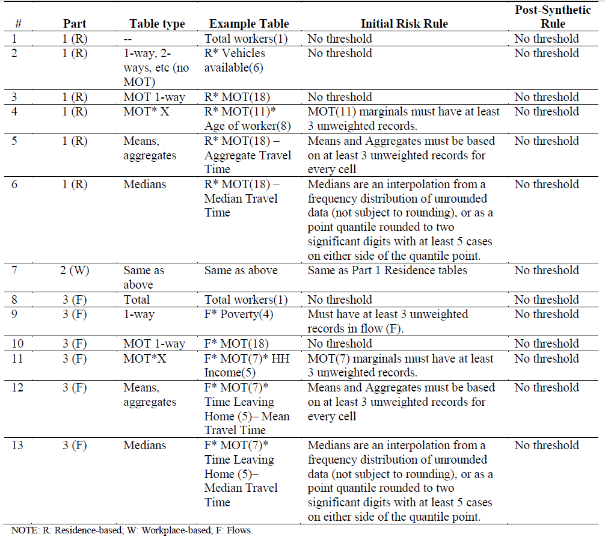
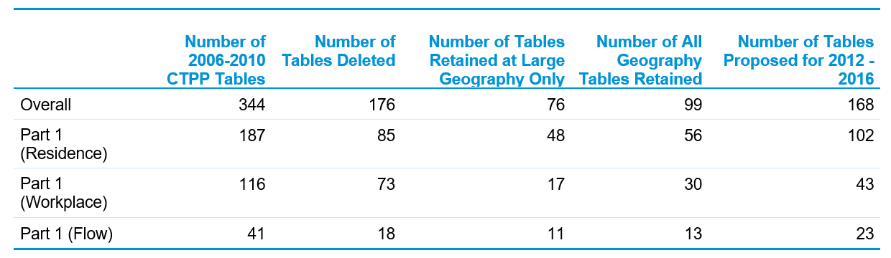

# Census Transportation Planning Products

The CTPP is an American Association of State Highway and Transportation Officials (AASHTO) sponsored Technical Services Program funded by member state transportation agencies and operates with support from FHWA, OST-R, FTA, Census Bureau, MPOs and TRB. The program includes data products; training and technical assistance; and research and outreach. The program is designed for the transportation community by the transportation community and is guided by an oversight board composed of MPOs and DOT representatives from across the United States. The CTPP uses data from the ACS and releases products based on the 5-year ACS. The CTPP summarizes data by place of residence, place of work, and flows from home to work. The data are available in both Census geography as well as custom geographies such as Traffic Analysis Zones (TAZs) and Traffic Analysis Districts (TAD) and are available for unique universes such as workers in households. The CTPP is built as a special tabulation by the Census Bureau for the transportation community. 

##	History of the CTPP

The availability of block-level data on commuting origins and destinations from the 1970 Census made possible the development for the first time of the Urban Transportation Planning Package (UTPP)15F . The 1970 UTPP was a special tabulation of Census data for individual metropolitan areas tailored to the geographic areas that are used in transportation planning. Local transportation planning organizations prepared specifications for the blocks that made up their traffic analysis zones, and the Census Bureau then produced a standard set of tabulations for those zones on a cost-reimbursable basis. Specifications for the content of the UTPP were submitted to the Bureau by FHWA. About 120 UTPPs were prepared using the 1970 Census.

The Census Bureau again produced the UTPP after the 1980 Census. This time specifications were developed and submitted to the Bureau by an ad hoc committee of transportation planners under the auspices of TRB. Funding for development of the necessary computer programs and administration of the 1980 project was provided by the DOT. The number of packages produced increased to over 150.

Significant innovations in the dissemination of the journey-to-work data were achieved for the 1990 Census. Two transportation planning packages were produced: statewide packages for each state and the District of Columbia and urban packages for the transportation study area defined by each MPO. Production of the transportation planning packages by the Census Bureau was sponsored by the state departments of transportation under a pooled funding arrangement with AASHTO. This pooled funding arrangement supported the production of data for the entire country instead of only those areas that decided to purchase the data as in previous Censuses. The number of packages produced (both state and metropolitan) increased to 415 for the 1990 Census.

The 1990 CTPP continued the program established in 1970 and conducted in 1980 in the same general format. A working group was established to develop the specifications for the 1990 CTPP for both the metropolitan data set and the statewide data set. This ad hoc group consisted of members from AASHTO, the National Association of Regional Councils, FHWA, FTA, the Census Bureau, plus experts in the field from states and MPOs. A similar group had developed the 1980 UTPP.

The statewide tabulations were the first product produced from the 1990 CTPP. A file was produced for each state, containing data for the households, persons, and workers who live in each city and county in the state, data on all workers working in each city and county in the state, and data on commuter flows between counties and cities. The urban tabulations were similar to the data provided in the statewide package, except that the data were tabulated on the basis of Census tracts or traffic analysis zones. The urban data were delivered after the delivery of the statewide packages. An urban package was produced for each metropolitan area for which the Census Bureau had an address coding capability. 

The main focus of the 2000 CTPP16F  program was to improve access to the data for a wide range of participants in the program, and to take advantage of more modern data processing and analysis technologies. The first step in this process was to contract with two companies to create software to accompany the distribution of the 2000 CTPP data on CD. More modern methods were also provided for agencies to create their TAZ equivalency files and for examining and updating the Workplace Files (Major Employer Lists) used in Place-of-Work coding.

FHWA, along with the Census Bureau’s geography division, sponsored an ArcView application using TIGER-Line files which CTPP 2000 customers used to define Traffic Analysis Zones (TAZ-UP). The Journey to Work (JTW) Branch contracted with ESRI to create an ArcView application called the Workplace Update Extension (Work–UP). This was a tool that MPOs could use to verify, correct, and add entries for employers in their area to ensure more accurate and complete workplace data. An extended Place-of-Work allocation system was also developed and implemented in the 2000 Census. Extended allocation went beyond that used in the main Census and resulted in a greater number of records containing codes all the way down to the block level.

###	Dancing with the DRB

Following the transition to the ACS, there were a series of changes that impacted the CTPP due to the smaller sample size in the ACS compared to the long form that was prevalent till 2000. In 2008, the Census Disclosure Review Board (DRB) reviewed the first ACS based CTPP product which was limited to the 3-year ACS data. The DRB handed down the following ruling:
_“The data will be rounded as all ACS special tabulations. DRB rules for means, medians and other quantiles will be applied. For all tables where means of transportation is shown but not crossed with any other variable, there is no threshold on the means of transportation categories. For all tables where means of transportation is shown and crossed with one or more other variables, there must be at least 3 unweighted cases for each category of means of transportation in a given geographic area to be shown. Categories and/or geographic areas should be collapsed to meet this threshold. For all flow tables, there must be at least 3 unweighted cases per pair of geographic areas with the exception of Total workers univariate and Means of Transportation univariate (no required threshold).” _

This ruling by the DRB led to AASHTO Standing committee on Planning (SCOP) approving funding for NCHRP 08-79: Producing Transportation Data Products from the ACS that Comply with Disclosure Rules and published as NCHRP web only report 18018F . This led to publication of disclosure proofed tables that shown in Figure \@ref(fig:dr1). Disclosure Proofing is a statistical process known as perturbation that was applied to the ACS data to assure that an individual could not be identified. The process has been well vetted in the transportation and statistical communities and has been well accepted.  

(\#fig:dr1)Disclosure Rules for CTPP Tables Based on the Five-Year ACS

Source: NCHRP Web Document 180 --- Producing Transportation Data Products from the American Community Survey That Comply with Disclosure Rules

Even after meeting all the requirements of the DRB for the 2006 – 2010 CTPP, the Census Bureau asked the CTPP Oversight Board to reduce the proposed 2012 -– 2016 tabulation by 2/3 and to reduce the number of tables produced at all geographies. Using a combination of table usage and subject matter expert insights, for the 2012 -– 2016 CTPP, the number of tables available for public release were decreased by 176. These changes by parts 1, 2, and 3 are shown in Figure \@ref(fig:t31).

(\#fig:t31)Changes between 2006 – 2010 CTPP and 2012 – 2016 CTPP

source: http://onlinepubs.trb.org/onlinepubs/conferences/2017/CensusData/FaellaNewData.pdf.

As stated previously, the CTPP produces commute characteristics for the population broken across different universes:

- All Persons; 
- All Workers; 
- Persons in Household; and
- Workers in Households; Workers not working at home.

For these different universes, commute characteristics as well as flow characteristics are available by various socioeconomic characteristics and commute mode. The complete list of tables and the associated geographies is available at the [CTPP website](https://ctpp.transportation.org/wp-content/uploads/sites/57/2019/01/CTPP-tables-based-on-2012-2016-ACS_uploadedToWeb-2.xlsx)

